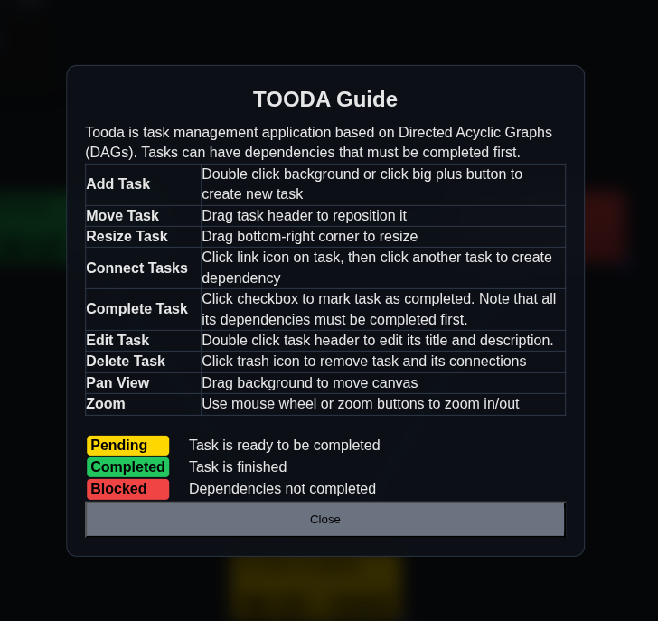

# Tooda

Some articles to get the idea:

- https://jameshfisher.com/2013/12/19/todo-dag/
- https://understandlegacycode.com/blog/a-process-to-do-safe-changes-in-a-complex-codebase/

Example tasks from [tasks-example.json](./docs/tasks-example.json)




## Dev

```sh
bun install
bun dev
```
